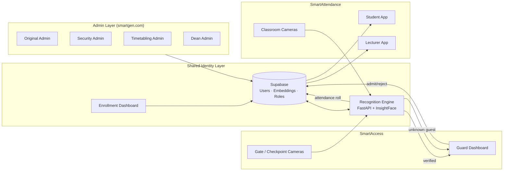

# Smart Gen — Facial Recognition Campus Platform
## Product Requirements Document (PRD)

| | |
|---|---|
| **Product** | Smart Gen (SmartAccess + SmartAttendance) |
| **Status** | Draft v1.0 — for review |
| **Author** | Drafted with Claude, from founder's handwritten design notes |
| **Repos** | `smart-gen.com` (web platform), `Alternative_Identifier` (recognition engine / prototype) |

---

## 1. Summary

Smart Gen is a facial-recognition platform for institutional campuses (schools/hostels)
that replaces manual ID checks and paper/roll-call attendance with a single biometric
identity layer. One recognition engine powers two products:

- **SmartAccess** — facial-recognition access control at security checkpoints (gates,
  hostel entrances). Identifies people as verified members (students, staff, etc.) or
  flags them as unknown guests for a guard decision.
- **SmartAttendance** — in-classroom facial recognition that takes lecture attendance
  automatically via IP cameras, and pushes schedules, alerts, and official
  communication to students and lecturers.

Both products share one identity store, one enrollment pipeline, and one
recognition engine, and are administered through a tiered admin system
(`smartgen.com`).

This document captures product scope, roles, workflows, data rules, and the
architecture needed to take the existing prototype (in `Alternative_Identifier`,
currently framed as a "Smart Hostel Security API") to the full Smart Gen product.

---

## 2. Problem & Goals

**Problem.** Manual gate checks and roll-call attendance are slow, spoofable
(borrowed IDs, buddy-marking), and produce no reliable analytics on access
patterns or class attendance. Guards and lecturers currently have no
systematic way to flag or correct misidentifications.

**Goals**
1. Recognize verified members at access points and in classrooms in real time,
   with a bounded, humane fallback for the guard/lecturer when recognition is
   uncertain.
2. Give every stakeholder role (guard, admin tiers, dean, timetabling office,
   lecturer, student) exactly the dashboard and data they need — no more, no less.
3. Automate attendance capture and notification end-to-end, including
   correction of false positives.
4. Enforce strict, auditable data-retention rules for biometric data (guest
   images, graduated-student data).
5. Ship on a lean stack (Flutter, FastAPI, Supabase, Vercel, GitHub) that a
   small team can operate.

**Non-goals (v1)**
- Payments, visitor pre-registration/booking, or public guest self-service.
- Cross-institution federation (multi-tenant SaaS) — v1 targets a single
  institution deployment, though the data model should not preclude it later.
- Liveness/anti-spoofing beyond what the chosen recognition library provides
  out of the box (flagged as a risk in §9).

---

## 3. Personas & Roles

| Role | Surface | Primary need |
|---|---|---|
| **Student** | SmartAttendance app | See schedule, know if I was marked present, get official mail |
| **Lecturer** | SmartAttendance app | Get attendance PDFs automatically, correct false positives, control class status |
| **Guard** | SmartAccess web dashboard | Fast admit/reject decisions on unknown faces, see verified faces in real time |
| **Original Admin** | Admin dashboard (web) | Own the whole system, monitor everything, manage other admins/cameras |
| **Security Admin** | Admin dashboard (web) | Oversee SmartAccess, camera health, access-control configuration |
| **Directorate of Timetabling Admin** | Admin dashboard (web) | Create/update/cancel timetables per course & year |
| **Dean of School Admin** | Admin dashboard (web) | Department-level visibility: class logs, cameras, rosters, timetables |
| **Temporary Admin** | Enrollment dashboard only | Time-boxed data entry / facial enrollment help; access expires after task |

All roles are provisioned by an admin (no public self-registration). See §5.

---

## 4. System Overview

**Two repos, two responsibilities**
- `Alternative_Identifier` → the **recognition engine + SmartAccess backend**
  (FastAPI, InsightFace embeddings, access decisioning, guard queue). This is
  where the prototype already lives.
- `smart-gen.com` → the **web platform**: marketing site, Enrollment
  Dashboard, Admin dashboards (all tiers), Guard dashboard, and the API
  gateway that fronts the recognition engine for the web surfaces.
- Student/Lecturer mobile experience (SmartAttendance) ships as a Flutter
  app talking to the same Supabase/FastAPI backend — "different app, same
  platform," per the source notes.

---

## 5. Enrollment & Identity

One **Enrollment Dashboard** provisions every user type: Student, Lecturer,
Guard, Staff, Admin (any tier).

**Fields captured**

| Field | Student/Lecturer/Guard/Staff | Admin |
|---|---|---|
| Username | ✓ | ✓ |
| Password | ✓ | ✓ |
| Email | ✓ | ✓ |
| Role | — (implicit) | ✓ (Original / Security / Timetabling / Dean / Temporary) |
| Facial enrollment (reference images → embedding) | ✓ (student/lecturer/staff/guard) | — |

**Flow**
1. Admin (Original Admin, Security Admin, or a Temporary Admin) enters the
   person's details and captures reference face images in the Enrollment
   Dashboard.
2. System generates the face embedding and stores it against the person's
   record (student_id / staff_id / admission_number).
3. The system emails the new user their username + password, with a link to
   `smartgen.com` (admin/guard/staff roles) or a deep link to the
   SmartAttendance app (student/lecturer).
4. **Login credentials are pre-configured** — there is no self-service
   sign-up. Credentials not already present in the system are rejected at
   login.
5. On login, credentials alone route the user to their correct dashboard —
   one login surface (`smartgen.com`), many destinations (Original Admin /
   Dean / Security / Timetabling / Guard).

**Temporary Admins.** Created by the Original Admin to help with bulk data
entry / facial enrollment. Scoped to the Enrollment Dashboard only, and their
credentials **expire automatically once the assigned task is marked complete**
— they never get standing access to any other dashboard.

---

## 6. SmartAccess (Access Control)

### 6.1 Recognition & decisioning

A face presented at a checkpoint camera resolves to one of two outcomes:

- **Verified member** → resolved to `{name, admission/staff number, role}` and
  logged; access flow proceeds per institutional policy (this PRD assumes
  auto-admit for verified members, since only unknown persons require a
  guard decision — confirm before build, see §9 open questions).
- **Unknown guest** → the frame's facial data is stored **temporarily** and
  surfaced to the guard for an Admit/Reject decision.

**Guest data lifecycle**
- On admit: guest record (and face data) remains valid for **24 hours**.
  If the same face reappears at any checkpoint within that window, their
  prior Admit decision (guest ID + guest name) auto-populates so the guard
  isn't re-deciding the same person.
- On reject: guest facial data is **deleted automatically**.
- After 24 hours from admission, guest data is purged regardless of
  re-appearance (must re-clear at the gate).

### 6.2 Guard dashboard

- Live queue of recognized faces, capped per refresh at **10 verified faces
  and 4 unknown-guest faces** to keep the UI decidable at a glance (a guard
  should never face an unbounded wall of faces).
- Each unknown face shows an **Admit / Reject** action. On Reject, the guard
  captures a **Guest ID** and **Guest Name** for the log.
- Guards authenticate with **username + password**, plus **location**
  (which checkpoint they're posted at) and **2FA**.

### 6.3 Admin analytics (Security Admin / Original Admin)

Dashboard surfaces:
- Access logs (who, when, which entrance, decision, confidence score)
- **False positive rate** — cases where a verified member was wrongly
  surfaced to the guard as an "unknown guest." This is a first-class metric
  the system must track, since it directly measures recognition quality.
- Movement/traffic rates (throughput per entrance, peak times)
- Camera status (online/offline/degraded per checkpoint)
- Direct access to camera feeds

### 6.4 Current prototype status (`Alternative_Identifier`)

Already implemented, to be hardened and extended rather than rebuilt:
- `POST /recognize` — image → embedding → match against enrolled
  students/guests → `process_access()` decision.
- `GET /students`, `GET /guests`, `GET /access-logs` — read models backing
  the dashboards above.
- `GET /guard/pending`, `POST /guard/admit/{id}`, `POST /guard/reject/{id}`
  — the guard decision loop.
- SQLite schema (`students`, `guests`, `access_logs`) — **to be migrated to
  Supabase/Postgres** for the production platform (multi-service access,
  RLS-based role enforcement, managed backups). SQLite remains fine for
  local dev/testing of the recognition engine in isolation.
- Multi-camera ingestion scaffolding under `src/camera/` (`camera_manager`,
  `live_camera_service`, `recognition_pipeline`) — this is the basis for
  both SmartAccess checkpoint cameras and SmartAttendance classroom cameras;
  it should become one shared "camera worker" service parameterized by
  purpose (`access` vs `attendance`) rather than two separate stacks.

---

## 7. SmartAttendance (Classroom Attendance)

### 7.1 Camera behavior

- Cameras are installed in lecture halls / classrooms and centrally managed
  through a **Camera Management System** (add/reconfigure/relocate IP
  cameras), shared with SmartAccess's camera infrastructure.
- Per scheduled lesson, a camera:
  1. **Activates 20 minutes before** the lesson's start time.
  2. Recognizes and timestamps attendees as they enter/are seen.
  3. **Deactivates 35 minutes into** the lesson.
  4. **Submits the attendance roll at the 40-minute mark.**
  5. Anyone first recognized **after the 35-minute cutoff** is marked
     **absent** for that session, even if physically present later.
- After submission, every enrolled student in that class receives a push
  notification: **"You attended"** or **"You missed a class"**, naming the
  class (unit) and facilitator (lecturer).

### 7.2 Lecturer capabilities

- Lecturer profile section is distinct from the student profile.
- Receives the **class attendance PDF** in their **History** tab at the end
  of each session.
- Can **amend the attendance list** to correct **false positives** (a
  student wrongly marked present/absent).
- Receives class reminders.
- Is the **only role that can change class status** (Postpone / Cancel).
  Absent an explicit change, a scheduled class's status defaults to and
  remains **"On."**

### 7.3 Student / Lecturer app — information architecture

Shared app shell ("SmartAttendance"), same platform, role-specific content.

**Top nav bar**

| Tab | Contents |
|---|---|
| Schedule | The student's/lecturer's general timetable for their course & year |
| Intraday | Only *today's* classes, with live status (On / Postponed / Cancelled) |
| Pigeonhole | Official mailing system — mail from admin, lecturers, and announcements |

**Bottom nav bar**

| Tab | Contents |
|---|---|
| Alerts | Class attendance notifications, class reminders, running attendance % |
| History | Lecturer: attendance PDFs per class. Student: personal attendance history |
| Profile | See below |

**Profile fields**

- Unit registration (admin-controlled, not self-service)
- Name + Admission Number
- Residence
- Contacts
- Course + Year
- **Officially enrolled (Yes/No)** — this flag gates what schedule, alerts,
  and announcements the person actually receives; an unenrolled record gets
  none of the above until flipped to Yes by an admin.

### 7.4 Timetabling → Schedule pipeline

The **Directorate of Timetabling Admin** creates/updates/cancels timetables
per course and year; on upload, students are **automatically enrolled into
the correct Schedule/Intraday view** based on their course-and-year profile
section — no manual per-student assignment needed.

---

## 8. Admin Tiers & Dashboard

All admin tiers share one Admin Dashboard shell at `smartgen.com`; the tier
in their profile determines what they see.

| Tier | Scope |
|---|---|
| **Original Admin** | System owner. Monitoring dashboard across *all* sections (Access/Attendance). Admits/creates other admins (including Temporary Admins). Camera management control access. |
| **Security Admin** | Oversight of SmartAccess. Checks camera status. Camera access/configuration within SmartAccess. Controls enrollment. |
| **Directorate of Timetabling Admin** | Create/update/cancel timetables. Upload per course & year; auto-pushes to student schedules. |
| **Dean of School Admin** | Per-school scope: class logs, venue camera access, total student roster by classification, total lectures/units for the department, access to all department timetables. |
| **Temporary Admin** | Enrollment Dashboard only (data entry + facial enrollment); credentials expire on task completion. |

---

## 9. Cross-Cutting System Rules

1. **Single login surface.** All admins (any tier), guards, and staff log in
   from `smartgen.com`; the account's role/credentials determine which
   dashboard they land on.
2. **Students & lecturers share a platform** (SmartAttendance) with
   role-differentiated views, not two separate codebases.
3. **No self-registration anywhere.** Login only succeeds for
   pre-provisioned credentials; anything else is rejected outright.
4. **Retention & deletion**
   - Rejected guest facial data → deleted immediately.
   - Admitted guest facial data → deleted automatically 24 hours after
     admission.
   - Student data → **auto-deleted after graduation**, timed to the
     student's course duration.
5. **Security & encryption.** Biometric data (face embeddings, reference
   images) must be encrypted at rest and in transit; this is explicitly
   called out as a hard requirement, not an optional hardening pass. Given
   the sensitivity of biometric + minor/young-adult student data, the
   platform should be built against a named data-protection standard from
   day one (e.g., the applicable national data protection act) rather than
   retrofitted later.
6. **Camera provisioning** happens from inside SmartAccess (checkpoint
   cameras) or SmartAttendance (classroom cameras) admin surfaces — one
   underlying camera-management service, two consumption contexts.
7. **False positives** are a tracked first-class concept in both products
   (SmartAccess: verified member flagged as unknown guest; SmartAttendance:
   wrongly marked present/absent) and must be both correctable by a human
   (guard / lecturer) and visible in analytics.

---

## 10. Proposed Technology Stack

| Layer | Choice | Notes |
|---|---|---|
| Recognition engine / API | **FastAPI** + InsightFace (already prototyped) | `Alternative_Identifier` |
| Student/Lecturer app | **Flutter** | SmartAttendance mobile-first, cross-platform |
| Web dashboards (Admin/Guard/Enrollment) | **Web app**, deployed on **Vercel** | `smart-gen.com` |
| Database / Auth | **Supabase** (Postgres + RLS + Auth/Storage) | replaces the current SQLite prototype for production |
| Source control / CI | **GitHub** | current repos |

**Migration note.** The existing SQLite schema (`students`, `guests`,
`access_logs`) maps cleanly onto Supabase tables; recommend adding
`role`, `admin_tier`, `course`, `year`, `officially_enrolled`,
`embedding` (vector column), and `expires_at` columns/tables as this PRD's
data needs are implemented, plus Row-Level Security policies per role.

---

## 11. Open Questions (need founder decision before implementation)

1. For a **verified** member at a SmartAccess checkpoint, does the gate
   auto-admit, or does a guard still confirm every entry (verified and
   unknown alike)? §6.1 assumes auto-admit for verified members.
2. What exactly triggers "graduation" for the student data auto-delete rule
   — a manual admin action, or a computed date from enrollment date + course
   duration?
3. Should Staff (non-teaching) go through SmartAccess only, or also need an
   attendance/presence record like students/lecturers?
4. Anti-spoofing / liveness detection (photo-of-a-photo attacks) — in scope
   for v1 or a fast-follow?
5. Multi-campus / multi-entrance support — is one institution's full rollout
   the entire v1 scope, or should the data model be multi-tenant from day one?

---

## 12. Success Metrics

- **Recognition accuracy**: false-positive and false-negative rate at
  checkpoints and in classrooms, tracked per camera/location.
- **Guard decision latency**: median time to Admit/Reject an unknown face.
- **Attendance automation coverage**: % of class sessions with zero manual
  lecturer correction needed.
- **Time-to-access**: median time from face capture to access decision at a
  checkpoint.
- **Data hygiene**: 100% of rejected/expired guest records purged within
  SLA; 100% of graduated-student records purged within SLA.

---

## 13. Phased Rollout

| Phase | Scope |
|---|---|
| **Phase 1** | Harden recognition engine + SmartAccess (this PRD's §6), migrate to Supabase, ship Enrollment Dashboard + Guard Dashboard + Original/Security Admin dashboards. |
| **Phase 2** | SmartAttendance classroom camera pipeline, Flutter student/lecturer app, Timetabling Admin dashboard. |
| **Phase 3** | Dean of School dashboard, Temporary Admin flow, full analytics (false-positive tracking, movement rates), data-retention automation end-to-end. |
